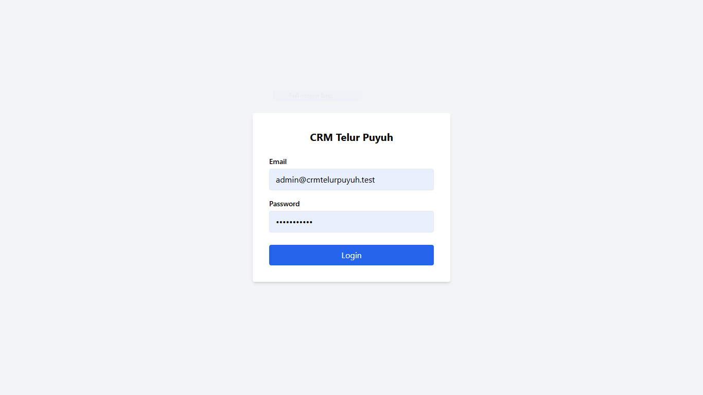
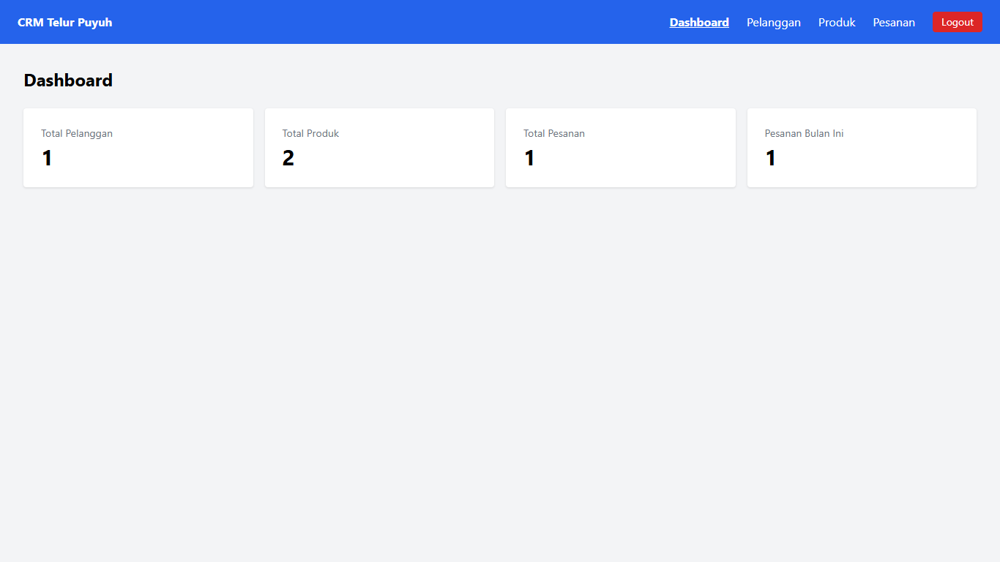
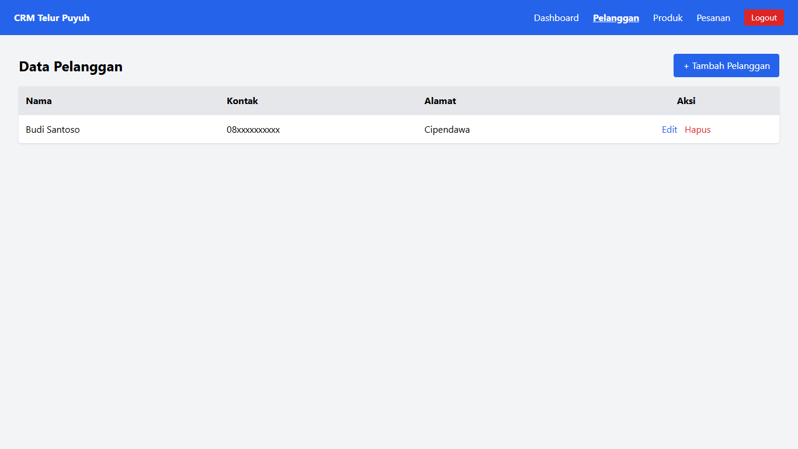
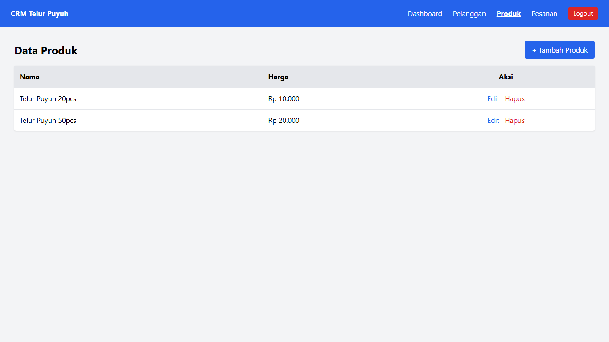
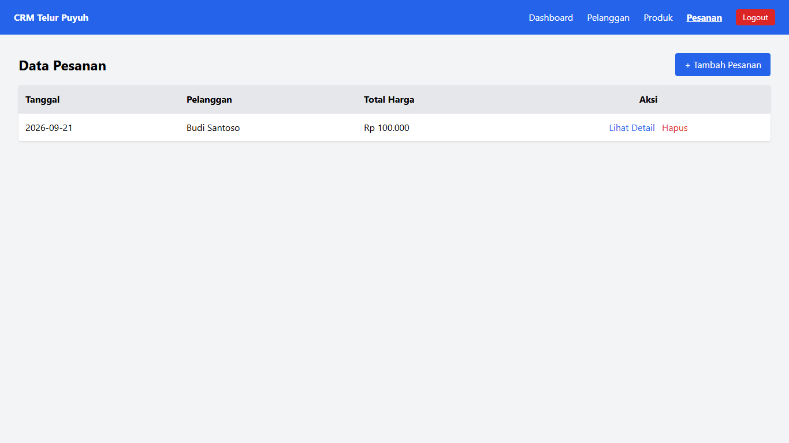
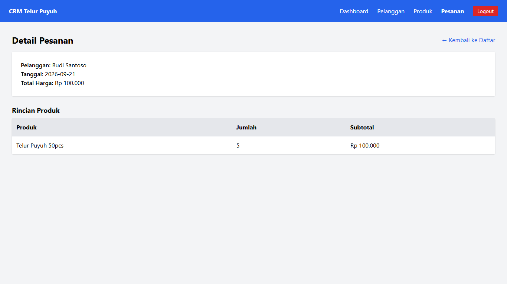

# CRM Telur Puyuh

Aplikasi CRM (Customer Relationship Management) sederhana untuk mencatat data pelanggan, produk, dan pesanan penjualan telur puyuh. Proyek ini dibangun sebagai portofolio pembelajaran web development, terinspirasi dari studi kasus nyata usaha telur puyuh keluarga.

## Latar Belakang

Proyek ini dibuat untuk mensimulasikan kebutuhan pencatatan penjualan pada usaha kecil, di mana pelanggan biasanya memesan lewat chat/telepon dan pemilik usaha mencatat transaksi secara manual. Aplikasi ini menggantikan pencatatan manual tersebut dengan sistem yang lebih terstruktur.

## Tech Stack

- **Back-end**: Laravel 12 (PHP 8.3)
- **Database**: MySQL
- **Styling**: Tailwind CSS
- **Interaksi**: Vanilla JavaScript
- **Version Control**: Git & GitHub

## Fitur

- Autentikasi Admin (login/logout)
- Dashboard ringkasan data (total pelanggan, produk, pesanan, dan pesanan bulan berjalan)
- Manajemen Data Pelanggan (CRUD)
- Manajemen Data Produk (CRUD)
- Manajemen Data Pesanan dengan multi-produk per pesanan (Tambah, Lihat Detail, Hapus)
- Perhitungan total harga otomatis berdasarkan produk dan jumlah yang dipesan

## Screenshot

### Halaman Login

### Dashboard

### Data Pelanggan

### Data Produk

### Data Pesanan

### Detail Pesanan

## Cara Menjalankan Proyek

1. Clone repository ini
git clone https://github.com/ragilfathur23-spec/crm-telur-puyuh.git
cd crm-telur-puyuh

2. Install dependency PHP

composer install

3. Salin file environment dan sesuaikan konfigurasi database

copy .env.example .env

   Sesuaikan `DB_DATABASE`, `DB_USERNAME`, `DB_PASSWORD` di file `.env` sesuai konfigurasi database lokal Anda.

4. Generate application key

php artisan key:generate

5. Jalankan migration

php artisan migrate

6. (Opsional) Jalankan seeder untuk membuat akun admin default

php artisan db:seed

7. Jalankan server lokal

php artisan serve

8. Akses aplikasi di `http://127.0.0.1:8000`

## Struktur Data

Aplikasi ini memiliki 5 entitas utama:
- **User** — akun admin (satu peran, tanpa pendaftaran publik)
- **Pelanggan** — data pembeli, dicatat oleh admin
- **Produk** — jenis produk yang dijual beserta harga
- **Pesanan** — transaksi pemesanan, terhubung ke satu pelanggan
- **Detail Pesanan** — rincian produk dan jumlah dalam satu pesanan

## Lisensi

Proyek ini dibuat untuk keperluan pembelajaran dan portofolio pribadi.